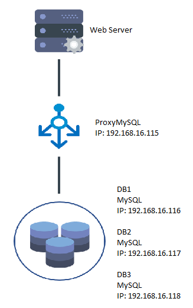

# ETS Basis Data Terdistribusi
05111640000115 Dewi Ayu Nirmalasari

## Daftar Isi
- [1. Desain dan Implementasi Infrastruktur](https://github.com/dnirmalasari18/bdt-multimaster#1-desain-dan-implementasi-infrastruktur)
- [2. Penggunaan Basis Data Terdistribusi dalam Aplikasi](https://github.com/dnirmalasari18/bdt-multimaster#2-penggunaan-basis-data-terdistribusi-dalam-aplikasi)
- [3. Simulasi Fail Over](https://github.com/dnirmalasari18/bdt-multimaster#3-simulasi-fail-over)
## 1. Desain dan Implementasi Infrasturktur
### A. Desain Infrastrukur Basis Data Terdistribusi
 

  ### Server
  Server yang digunakan sebanyak 5 buah, dengan perincian sebagai berikut:
#### a. Server Database
Sebanyak 3 buah. Ketiganya memiliki spesifikasi yang sama, yaitu:
- Menggunakan ```MySQL server```
- OS : ```bento/ubuntu-16.04```
- RAM: 512 MB

#### b. Load Balancer
Sebanyak 1 buah, dengan spesifikasi:
- ```Proxy MySQL```
- OS : ```bento/ubuntu-16.04```
- RAM: 512 MB

#### c. Web Server Apache
Sebanyak 1 buah.

### B. Implementasi Infrastruktur Basis Data Terdistribusi
#### a. Proses Instalasi
Aplikasi yang perlu diinstall sebelumnya:
- Vagrant(versi 2.2.5)
- Virtual Box(versi 6.0.12)

#### b. Tahapan konfigurasi
Langkah-langkah yang dilakukan dalam tahapan konfigurasi dijelaskan sebagai berikut.
- Membuat `VagrantFile`<br>
  Vagrantfile dibuat dengan mengetikkan `vagrant init` pada _command line_. Setelahnya, vagrantfile akan terbuat pada direktori dimana command tersebut dijalankan.
- Mengubah `Vagrantfile` sesuai dengan rancangan Infrastruktur yang sudah dibuat.
  ```ruby
  # -*- mode: ruby -*-
  # vi: set ft=ruby :

  # All Vagrant configuration is done below. The "2" in Vagrant.configure
  # configures the configuration version (we support older styles for
  # backwards compatibility). Please don't change it unless you know what
  # you're doing.

  Vagrant.configure("2") do |config|
    
    # MySQL Cluster dengan 3 node
    (1..3).each do |i|
      config.vm.define "db#{i}" do |node|
        node.vm.hostname = "db#{i}"
        node.vm.box = "bento/ubuntu-16.04"
        node.vm.network "private_network", ip: "192.168.16.11#{i+5}"

        # Opsional. Edit sesuai dengan nama network adapter di komputer
        #node.vm.network "public_network", bridge: "Qualcomm Atheros QCA9377 Wireless Network Adapter"
        
        node.vm.provider "virtualbox" do |vb|
          vb.name = "db#{i}"
          vb.gui = false
          vb.memory = "512"
        end
    
        node.vm.provision "shell", path: "deployMySQL#{i}.sh", privileged: false
      end
    end

    config.vm.define "proxy" do |proxy|
      proxy.vm.hostname = "proxy"
      proxy.vm.box = "bento/ubuntu-16.04"
      proxy.vm.network "private_network", ip: "192.168.16.115"
      #proxy.vm.network "public_network",  bridge: "Qualcomm Atheros QCA9377 Wireless Network Adapter"
      
      proxy.vm.provider "virtualbox" do |vb|
        vb.name = "proxy"
        vb.gui = false
        vb.memory = "512"
      end

      proxy.vm.provision "shell", path: "deployProxySQL.sh", privileged: false
    end

  end
  ```
- Membuat Script Provisioning
  - Provisioning untuk Proxy SQL pada file `deployProxySQL.sh`
    ```bash
    # Changing the APT sources.list to kambing.ui.ac.id
    sudo cp '/vagrant/sources.list' '/etc/apt/sources.list'

    # Updating the repo with the new sources
    sudo apt-get update -y

    cd /tmp
    curl -OL https://github.com/sysown/proxysql/releases/download/v1.4.4/proxysql_1.4.4-ubuntu16_amd64.deb
    curl -OL https://dev.mysql.com/get/Downloads/MySQL-5.7/mysql-common_5.7.23-1ubuntu16.04_amd64.deb
    curl -OL https://dev.mysql.com/get/Downloads/MySQL-5.7/mysql-community-client_5.7.23-1ubuntu16.04_amd64.deb
    curl -OL https://dev.mysql.com/get/Downloads/MySQL-5.7/mysql-client_5.7.23-1ubuntu16.04_amd64.deb

    sudo apt-get install libaio1
    sudo apt-get install libmecab2

    sudo dpkg -i proxysql_1.4.4-ubuntu16_amd64.deb
    sudo dpkg -i mysql-common_5.7.23-1ubuntu16.04_amd64.deb
    sudo dpkg -i mysql-community-client_5.7.23-1ubuntu16.04_amd64.deb
    sudo dpkg -i mysql-client_5.7.23-1ubuntu16.04_amd64.deb

    sudo ufw allow 33061
    sudo ufw allow 3306

    sudo systemctl start proxysql
    #mysql -u admin -padmin -h 127.0.0.1 -P 6032 < /vagrant/proxysql.sql
    ```
    <br>

  - Provisioning untuk database
    - DB1 pada file `deployMySQL1.sh`
      ```bash
      # Changing the APT sources.list to kambing.ui.ac.id
      sudo cp '/vagrant/sources.list' '/etc/apt/sources.list'

      # Updating the repo with the new sources
      sudo apt-get update -y

      # Install required library
      sudo apt-get install libaio1
      sudo apt-get install libmecab2

      # Get MySQL binaries
      curl -OL https://dev.mysql.com/get/Downloads/MySQL-5.7/mysql-common_5.7.23-1ubuntu16.04_amd64.deb
      curl -OL https://dev.mysql.com/get/Downloads/MySQL-5.7/mysql-community-client_5.7.23-1ubuntu16.04_amd64.deb
      curl -OL https://dev.mysql.com/get/Downloads/MySQL-5.7/mysql-client_5.7.23-1ubuntu16.04_amd64.deb
      curl -OL https://dev.mysql.com/get/Downloads/MySQL-5.7/mysql-community-server_5.7.23-1ubuntu16.04_amd64.deb

      # Setting input for installation
      sudo debconf-set-selections <<< 'mysql-community-server mysql-community-server/root-pass password admin'
      sudo debconf-set-selections <<< 'mysql-community-server mysql-community-server/re-root-pass password admin'

      # Install MySQL Community Server
      sudo dpkg -i mysql-common_5.7.23-1ubuntu16.04_amd64.deb
      sudo dpkg -i mysql-community-client_5.7.23-1ubuntu16.04_amd64.deb
      sudo dpkg -i mysql-client_5.7.23-1ubuntu16.04_amd64.deb
      sudo dpkg -i mysql-community-server_5.7.23-1ubuntu16.04_amd64.deb

      # Allow port on firewall
      sudo ufw allow 33061
      sudo ufw allow 3306

      # Copy MySQL configurations
      sudo cp /vagrant/my11.cnf /etc/mysql/my.cnf

      # Restart MySQL services
      sudo service mysql restart

      # Cluster bootstrapping
      sudo mysql -u root -padmin < /vagrant/cluster_bootstrap.sql
      sudo mysql -u root -padmin < /vagrant/addition_to_sys.sql
      sudo mysql -u root -padmin < /vagrant/create_proxysql_user.sql
      ```
    - DB2 pada file `deployMySQL2.sh`
      ```bash
      # Changing the APT sources.list to kambing.ui.ac.id
      sudo cp '/vagrant/sources.list' '/etc/apt/sources.list'

      # Updating the repo with the new sources
      sudo apt-get update -y

      # Install required library
      sudo apt-get install libaio1
      sudo apt-get install libmecab2

      # Get MySQL binaries
      curl -OL https://dev.mysql.com/get/Downloads/MySQL-5.7/mysql-common_5.7.23-1ubuntu16.04_amd64.deb
      curl -OL https://dev.mysql.com/get/Downloads/MySQL-5.7/mysql-community-client_5.7.23-1ubuntu16.04_amd64.deb
      curl -OL https://dev.mysql.com/get/Downloads/MySQL-5.7/mysql-client_5.7.23-1ubuntu16.04_amd64.deb
      curl -OL https://dev.mysql.com/get/Downloads/MySQL-5.7/mysql-community-server_5.7.23-1ubuntu16.04_amd64.deb

      # Setting input for installation
      sudo debconf-set-selections <<< 'mysql-community-server mysql-community-server/root-pass password admin'
      sudo debconf-set-selections <<< 'mysql-community-server mysql-community-server/re-root-pass password admin'

      # Install MySQL Community Server
      sudo dpkg -i mysql-common_5.7.23-1ubuntu16.04_amd64.deb
      sudo dpkg -i mysql-community-client_5.7.23-1ubuntu16.04_amd64.deb
      sudo dpkg -i mysql-client_5.7.23-1ubuntu16.04_amd64.deb
      sudo dpkg -i mysql-community-server_5.7.23-1ubuntu16.04_amd64.deb

      # Allow port on firewall
      sudo ufw allow 33061
      sudo ufw allow 3306

      # Copy MySQL configurations
      sudo cp /vagrant/my12.cnf /etc/mysql/my.cnf

      # Restart MySQL services
      sudo service mysql restart

      # Cluster bootstrapping
      sudo mysql -u root -padmin < /vagrant/cluster_member.sql
      ```
    - DB3 pada file `deployMySQL3.sh`
      ```bash
      # Changing the APT sources.list to kambing.ui.ac.id
      sudo cp '/vagrant/sources.list' '/etc/apt/sources.list'

      # Updating the repo with the new sources
      sudo apt-get update -y

      # Install required library
      sudo apt-get install libaio1
      sudo apt-get install libmecab2

      # Get MySQL binaries
      curl -OL https://dev.mysql.com/get/Downloads/MySQL-5.7/mysql-common_5.7.23-1ubuntu16.04_amd64.deb
      curl -OL https://dev.mysql.com/get/Downloads/MySQL-5.7/mysql-community-client_5.7.23-1ubuntu16.04_amd64.deb
      curl -OL https://dev.mysql.com/get/Downloads/MySQL-5.7/mysql-client_5.7.23-1ubuntu16.04_amd64.deb
      curl -OL https://dev.mysql.com/get/Downloads/MySQL-5.7/mysql-community-server_5.7.23-1ubuntu16.04_amd64.deb

      # Setting input for installation
      sudo debconf-set-selections <<< 'mysql-community-server mysql-community-server/root-pass password admin'
      sudo debconf-set-selections <<< 'mysql-community-server mysql-community-server/re-root-pass password admin'

      # Install MySQL Community Server
      sudo dpkg -i mysql-common_5.7.23-1ubuntu16.04_amd64.deb
      sudo dpkg -i mysql-community-client_5.7.23-1ubuntu16.04_amd64.deb
      sudo dpkg -i mysql-client_5.7.23-1ubuntu16.04_amd64.deb
      sudo dpkg -i mysql-community-server_5.7.23-1ubuntu16.04_amd64.deb

      # Allow port on firewall
      sudo ufw allow 33061
      sudo ufw allow 3306

      # Copy MySQL configurations
      sudo cp /vagrant/my13.cnf /etc/mysql/my.cnf

      # Restart MySQL services
      sudo service mysql restart

      # Cluster bootstrapping
      sudo mysql -u root -padmin < /vagrant/cluster_member.sql
      ```
  <br>

- Membuat File Konfigurasi SQL
  - File Konfigurasi DB1(`my11.cnf`)
    ```ruby
    #
    # The MySQL database server configuration file.
    #
    # You can copy this to one of:
    # - "/etc/mysql/my.cnf" to set global options,
    # - "~/.my.cnf" to set user-specific options.
    # 
    # One can use all long options that the program supports.
    # Run program with --help to get a list of available options and with
    # --print-defaults to see which it would actually understand and use.
    #
    # For explanations see
    # http://dev.mysql.com/doc/mysql/en/server-system-variables.html

    #
    # * IMPORTANT: Additional settings that can override those from this file!
    #   The files must end with '.cnf', otherwise they'll be ignored.
    #

    !includedir /etc/mysql/conf.d/
    !includedir /etc/mysql/mysql.conf.d/

    [mysqld]

    # General replication settings
    gtid_mode = ON
    enforce_gtid_consistency = ON
    master_info_repository = TABLE
    relay_log_info_repository = TABLE
    binlog_checksum = NONE
    log_slave_updates = ON
    log_bin = binlog
    binlog_format = ROW
    transaction_write_set_extraction = XXHASH64
    loose-group_replication_bootstrap_group = OFF
    loose-group_replication_start_on_boot = ON
    loose-group_replication_ssl_mode = REQUIRED
    loose-group_replication_recovery_use_ssl = 1

    # Shared replication group configuration
    loose-group_replication_group_name = "8f22f846-9922-4139-b2b7-097d185a93cb"
    loose-group_replication_ip_whitelist = "192.168.16.116, 192.168.16.117, 192.168.16.118"
    loose-group_replication_group_seeds = "192.168.16.116:33061, 192.168.16.117:33061, 192.168.16.118:33061"

    # Single or Multi-primary mode? Uncomment these two lines
    # for multi-primary mode, where any host can accept writes
    loose-group_replication_single_primary_mode = OFF
    loose-group_replication_enforce_update_everywhere_checks = ON

    # Host specific replication configuration
    server_id = 11
    bind-address = "192.168.16.116"
    report_host = "192.168.16.116"
    loose-group_replication_local_address = "192.168.16.116:33061"
    ```
  - File Konfigurasi DB2(`my12.cnf`)
    ```ruby
    #
    # The MySQL database server configuration file.
    #
    # You can copy this to one of:
    # - "/etc/mysql/my.cnf" to set global options,
    # - "~/.my.cnf" to set user-specific options.
    # 
    # One can use all long options that the program supports.
    # Run program with --help to get a list of available options and with
    # --print-defaults to see which it would actually understand and use.
    #
    # For explanations see
    # http://dev.mysql.com/doc/mysql/en/server-system-variables.html

    #
    # * IMPORTANT: Additional settings that can override those from this file!
    #   The files must end with '.cnf', otherwise they'll be ignored.
    #

    !includedir /etc/mysql/conf.d/
    !includedir /etc/mysql/mysql.conf.d/

    [mysqld]

    # General replication settings
    gtid_mode = ON
    enforce_gtid_consistency = ON
    master_info_repository = TABLE
    relay_log_info_repository = TABLE
    binlog_checksum = NONE
    log_slave_updates = ON
    log_bin = binlog
    binlog_format = ROW
    transaction_write_set_extraction = XXHASH64
    loose-group_replication_bootstrap_group = OFF
    loose-group_replication_start_on_boot = ON
    loose-group_replication_ssl_mode = REQUIRED
    loose-group_replication_recovery_use_ssl = 1

    # Shared replication group configuration
    loose-group_replication_group_name = "8f22f846-9922-4139-b2b7-097d185a93cb"
    loose-group_replication_ip_whitelist = "192.168.16.116, 192.168.16.117, 192.168.16.118"
    loose-group_replication_group_seeds = "192.168.16.116:33061, 192.168.16.117:33061, 192.168.16.118:33061"

    # Single or Multi-primary mode? Uncomment these two lines
    # for multi-primary mode, where any host can accept writes
    loose-group_replication_single_primary_mode = OFF
    loose-group_replication_enforce_update_everywhere_checks = ON

    # Host specific replication configuration
    server_id = 117
    bind-address = "192.168.16.117"
    report_host = "192.168.16.117"
    loose-group_replication_local_address = "192.168.16.117:33061"
    ```
  - File Konfigurasi DB3(`my13.cnf`)
    ```ruby
    #
    # The MySQL database server configuration file.
    #
    # You can copy this to one of:
    # - "/etc/mysql/my.cnf" to set global options,
    # - "~/.my.cnf" to set user-specific options.
    # 
    # One can use all long options that the program supports.
    # Run program with --help to get a list of available options and with
    # --print-defaults to see which it would actually understand and use.
    #
    # For explanations see
    # http://dev.mysql.com/doc/mysql/en/server-system-variables.html

    #
    # * IMPORTANT: Additional settings that can override those from this file!
    #   The files must end with '.cnf', otherwise they'll be ignored.
    #

    !includedir /etc/mysql/conf.d/
    !includedir /etc/mysql/mysql.conf.d/

    [mysqld]

    # General replication settings
    gtid_mode = ON
    enforce_gtid_consistency = ON
    master_info_repository = TABLE
    relay_log_info_repository = TABLE
    binlog_checksum = NONE
    log_slave_updates = ON
    log_bin = binlog
    binlog_format = ROW
    transaction_write_set_extraction = XXHASH64
    loose-group_replication_bootstrap_group = OFF
    loose-group_replication_start_on_boot = ON
    loose-group_replication_ssl_mode = REQUIRED
    loose-group_replication_recovery_use_ssl = 1

    # Shared replication group configuration
    loose-group_replication_group_name = "8f22f846-9922-4139-b2b7-097d185a93cb"
    loose-group_replication_ip_whitelist = "192.168.16.116, 192.168.16.117, 192.168.16.118"
    loose-group_replication_group_seeds = "192.168.16.116:33061, 192.168.16.117:33061, 192.168.16.118:33061"

    # Single or Multi-primary mode? Uncomment these two lines
    # for multi-primary mode, where any host can accept writes
    loose-group_replication_single_primary_mode = OFF
    loose-group_replication_enforce_update_everywhere_checks = ON

    # Host specific replication configuration
    server_id = 118
    bind-address = "192.168.16.118"
    report_host = "192.168.16.118"
    loose-group_replication_local_address = "192.168.16.118:33061"
    ```
  <br>

- Membuat File Script SQL Pendukung
  - File `addition_to_sys.sql`
    ```sql
    USE sys;

    DELIMITER $$

    CREATE FUNCTION IFZERO(a INT, b INT)
    RETURNS INT
    DETERMINISTIC
    RETURN IF(a = 0, b, a)$$

    CREATE FUNCTION LOCATE2(needle TEXT(10000), haystack TEXT(10000), offset INT)
    RETURNS INT
    DETERMINISTIC
    RETURN IFZERO(LOCATE(needle, haystack, offset), LENGTH(haystack) + 1)$$

    CREATE FUNCTION GTID_NORMALIZE(g TEXT(10000))
    RETURNS TEXT(10000)
    DETERMINISTIC
    RETURN GTID_SUBTRACT(g, '')$$

    CREATE FUNCTION GTID_COUNT(gtid_set TEXT(10000))
    RETURNS INT
    DETERMINISTIC
    BEGIN
      DECLARE result BIGINT DEFAULT 0;
      DECLARE colon_pos INT;
      DECLARE next_dash_pos INT;
      DECLARE next_colon_pos INT;
      DECLARE next_comma_pos INT;
      SET gtid_set = GTID_NORMALIZE(gtid_set);
      SET colon_pos = LOCATE2(':', gtid_set, 1);
      WHILE colon_pos != LENGTH(gtid_set) + 1 DO
        SET next_dash_pos = LOCATE2('-', gtid_set, colon_pos + 1);
        SET next_colon_pos = LOCATE2(':', gtid_set, colon_pos + 1);
        SET next_comma_pos = LOCATE2(',', gtid_set, colon_pos + 1);
        IF next_dash_pos < next_colon_pos AND next_dash_pos < next_comma_pos THEN
          SET result = result +
            SUBSTR(gtid_set, next_dash_pos + 1,
                    LEAST(next_colon_pos, next_comma_pos) - (next_dash_pos + 1)) -
            SUBSTR(gtid_set, colon_pos + 1, next_dash_pos - (colon_pos + 1)) + 1;
        ELSE
          SET result = result + 1;
        END IF;
        SET colon_pos = next_colon_pos;
      END WHILE;
      RETURN result;
    END$$

    CREATE FUNCTION gr_applier_queue_length()
    RETURNS INT
    DETERMINISTIC
    BEGIN
      RETURN (SELECT sys.gtid_count( GTID_SUBTRACT( (SELECT
    Received_transaction_set FROM performance_schema.replication_connection_status
    WHERE Channel_name = 'group_replication_applier' ), (SELECT
    @@global.GTID_EXECUTED) )));
    END$$

    CREATE FUNCTION gr_member_in_primary_partition()
    RETURNS VARCHAR(3)
    DETERMINISTIC
    BEGIN
      RETURN (SELECT IF( MEMBER_STATE='ONLINE' AND ((SELECT COUNT(*) FROM
    performance_schema.replication_group_members WHERE MEMBER_STATE != 'ONLINE') >=
    ((SELECT COUNT(*) FROM performance_schema.replication_group_members)/2) = 0),
    'YES', 'NO' ) FROM performance_schema.replication_group_members JOIN
    performance_schema.replication_group_member_stats USING(member_id));
    END$$

    CREATE VIEW gr_member_routing_candidate_status AS SELECT
    sys.gr_member_in_primary_partition() as viable_candidate,
    IF( (SELECT (SELECT GROUP_CONCAT(variable_value) FROM
    performance_schema.global_variables WHERE variable_name IN ('read_only',
    'super_read_only')) != 'OFF,OFF'), 'YES', 'NO') as read_only,
    sys.gr_applier_queue_length() as transactions_behind, Count_Transactions_in_queue as 'transactions_to_cert' from performance_schema.replication_group_member_stats;$$

    DELIMITER ;

    ```
  - File `cluster_bootstrap.sql`
    ```sql
    SET SQL_LOG_BIN=0;
    CREATE USER 'repl'@'%' IDENTIFIED BY 'password' REQUIRE SSL;
    GRANT REPLICATION SLAVE ON *.* TO 'repl'@'%';
    FLUSH PRIVILEGES;
    SET SQL_LOG_BIN=1;
    CHANGE MASTER TO MASTER_USER='repl', MASTER_PASSWORD='password' FOR CHANNEL 'group_replication_recovery';
    INSTALL PLUGIN group_replication SONAME 'group_replication.so';

    SET GLOBAL group_replication_bootstrap_group=ON;
    START GROUP_REPLICATION;
    SET GLOBAL group_replication_bootstrap_group=OFF;

    CREATE DATABASE lpencerdas;
    --CREATE TABLE playground.equipment ( id INT NOT NULL AUTO_INCREMENT, type VARCHAR(50), quant INT, color VARCHAR(25), PRIMARY KEY(id));
    --INSERT INTO playground.equipment (type, quant, color) VALUES ("slide", 2, "blue");
    ```
  - File `cluster_member.sql`
    ```sql
    SET SQL_LOG_BIN=0;
    CREATE USER 'repl'@'%' IDENTIFIED BY 'password' REQUIRE SSL;
    GRANT REPLICATION SLAVE ON *.* TO 'repl'@'%';
    FLUSH PRIVILEGES;
    SET SQL_LOG_BIN=1;
    CHANGE MASTER TO MASTER_USER='repl', MASTER_PASSWORD='password' FOR CHANNEL 'group_replication_recovery';
    INSTALL PLUGIN group_replication SONAME 'group_replication.so';
    ```
  - File `create_proxysql_user.sql`
    ```sql
    CREATE USER 'monitor'@'%' IDENTIFIED BY 'monitorpassword';
    GRANT SELECT on sys.* to 'monitor'@'%';
    FLUSH PRIVILEGES;

    CREATE USER 'user'@'%' IDENTIFIED BY 'password';
    GRANT ALL PRIVILEGES on lpencerdas.* to 'user'@'%';
    FLUSH PRIVILEGES;
    ```
  - File `proxysql.sql`
    ```sql
    UPDATE global_variables SET variable_value='admin:password' WHERE variable_name='admin-admin_credentials';
    LOAD ADMIN VARIABLES TO RUNTIME;
    SAVE ADMIN VARIABLES TO DISK;

    UPDATE global_variables SET variable_value='monitor' WHERE variable_name='mysql-monitor_username';
    LOAD MYSQL VARIABLES TO RUNTIME;
    SAVE MYSQL VARIABLES TO DISK;

    INSERT INTO mysql_group_replication_hostgroups (writer_hostgroup, backup_writer_hostgroup, reader_hostgroup, offline_hostgroup, active, max_writers, writer_is_also_reader, max_transactions_behind) VALUES (2, 4, 3, 1, 1, 3, 1, 100);

    INSERT INTO mysql_servers(hostgroup_id, hostname, port) VALUES (2, '192.168.16.116', 3306);
    INSERT INTO mysql_servers(hostgroup_id, hostname, port) VALUES (2, '192.168.16.117', 3306);
    INSERT INTO mysql_servers(hostgroup_id, hostname, port) VALUES (2, '192.168.16.118', 3306);

    LOAD MYSQL SERVERS TO RUNTIME;
    SAVE MYSQL SERVERS TO DISK;

    INSERT INTO mysql_users(username, password, default_hostgroup) VALUES ('user', 'password', 2);
    LOAD MYSQL USERS TO RUNTIME;
    SAVE MYSQL USERS TO DISK;
    ```

- Menjalankan Vagrant
  - Menjalankan `Vagrant Up` pada _command line_
  - Mengecek apakah vagrant sudah berjalan dengan baik dengan cara menjalankan `Vagrant Status` pada _command line_ atau dengan mengecek pada Virtual Machine secara langsung

- Melakukan konfigurasi tambahan untuk proxysql.sql
  - Masuk ke Virtual Machine ProxySql
    ```
    vagrant ssh proxy
    ```
  - Masukkan file `proxysql.sql` yang telah dibuat tadi sebagai provisioning tambahan
    ```
    mysql -u admin -padmin -h 127.0.0.1 -P 6032 < /vagrant/proxysql.sql
    ```

## 2. Penggunaan Basis Data Terdistribusi dalam Aplikasi
### LPencerdas
LPencerdas merupakan aplikasi berbasis website milik Laboratorium Pemrograman 1 Informatika ITS yang dibuat menggunakan framework Laravel. LPencerdas sendiri dibangun dengan tujuan untuk menjadi wadah internal Informatika ITS membagikan materi dalam bentuk teks, gambar, atau video seputar pelajaran Informatika yang disesuaikan dengan kurikulum Departemen Informatika ITS.


### Implementasi Basis Data Terdistribusi dalam LPencerdas
Berikut langkah-langkah mengimplementasikan basis data terdistribusi dalam LPencerdas.
1. Instalasi LPencerdas<br>
Instalasi LPencerdas diawali dengan meng-_clone_ repo LPencerdas dari akun github lpif. Langkah-langkah yang dilakukan antara lain dengan memasukkan inputan di bawah ini ke dalam _command line_.
```
git clone https://github.com/lpif/lpencerdas.git
composer install
composer dump-autoload
cp .env.example .env
```

2. Mengubah file .env<br>
Ubah konfigurasi awal yang sudah ada pada file ```.env``` menjadi:
```s
DB_CONNECTION=mysql
DB_HOST=192.168.16.115
DB_PORT=6033
DB_DATABASE=lpencerdas
DB_USERNAME=user
DB_PASSWORD=password
```
- `DB_HOST` disesuaikan dengan IP dari ProxySQL
- `DB_PORT` disesuaikan dengan port dari ProxySQL
- `DB_DATABASE` disesuaikan dengan database yang dibutuhkan oleh aplikasi
- `DB_USERNAME` dan `DB_PASSWORD` disesuaikan dengan user dan password yang dibuat pada file [`create_proxysql_user.sql`](https://github.com/dnirmalasari18/bdt-multimaster/blob/master/config/create_proxysql_user.sql)

3. Melakukan _generating key_<br>
_Generating key_ dilakukan dengan menjalankan `php artisan key:generate` pada _command line_. 

4. Menjalankan _Laravel Migration_ dan _Seeding_<br>
_Laravel Migration_ dan _Seeding_ merupakan fitur dari laravel yang mampu membantu _developer_ untuk membangun _database_ yang mencakup command _`create`_, _`drop`_, serta _`insert`_. Langkah-langkah yang dilakukan antara lain dengan memasukkan inputan di bawah ini ke dalam _command line_.
```
php artisan migrate
php artisan db:seed
```

5. Menjalankan aplikasi pada localhost<br>
Jalankan `php artisan serve` pada _command line_ untuk menjalankan aplikasi


## 3. Simulasi Fail Over
1. Mematikan Salah Satu Server Basis Data
2. Melakukan Pengubahan Data pada Aplikasi
3. Mengaktifkan Kembali Server yang Dimatikan dan Verifikasi Hasil Replikasi