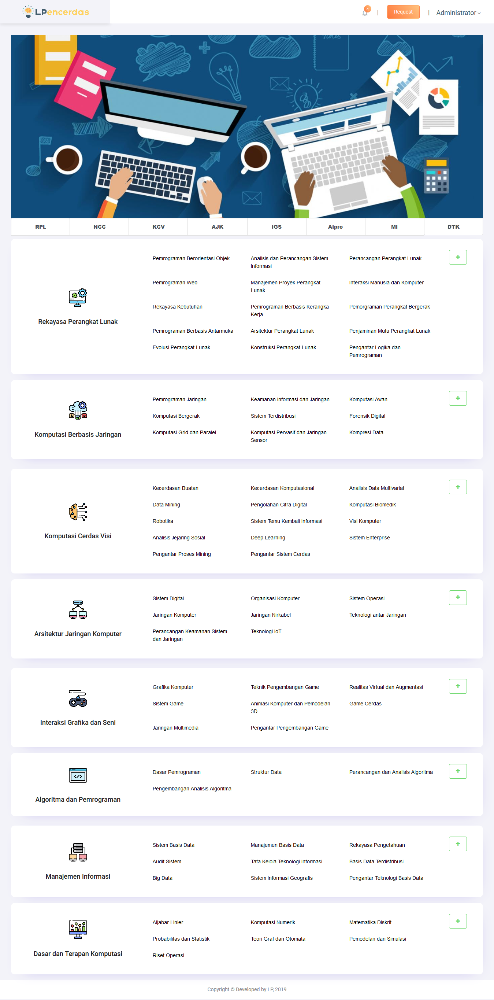

# ETS Basis Data Terdistribusi
05111640000115 Dewi Ayu Nirmalasari

## 1. Desain dan Implementasi Infrasturktur
### A. Desain Infrastrukur Basis Data Terdistribusi


### Server
Server yang digunakan sebanyak 5 buah, dengan perincian sebagai berikut:
#### a. Server Database
Sebanyak 3 buah. Ketiganya memiliki spesifikasi yang sama, yaitu:
- Menggunakan ```MySQL server```
- OS : ```bento/ubuntu-16.04```
- RAM: 512 MB

#### b. Load Balancer
Sebanyak 1 buah, dengan spesifikasi:
- ```Proxy MySQL```
- OS : ```bento/ubuntu-16.04```
- RAM: 512 MB

#### c. Web Server Apache
Sebanyak 1 buah.

### B. Implementasi Infrastruktur Basis Data Terdistribusi
#### a. Proses Instalasi
#### b. Tahapan konfirgurasi

## 2. Penggunaan Basis Data Terdistribusi dalam Aplikasi
### LPencerdas
LPencerdas merupakan aplikasi berbasis website milik Laboratorium Pemrograman 1 Informatika ITS yang dibuat menggunakan framework Laravel. LPencerdas sendiri dibangun dengan tujuan agar nantinya wadah internal Informatika ITS membagikan materi dalam bentuk teks, gambar, atau video seputar pelajaran Informatika yang disesuaikan dengan kurikulum Departemen Informatika ITS.


### Implementasi Basis Data Terdistribusi dalam LPencerdas
Berikut langkah-langkah mengimplementasikan basis data terdistribusi dalam LPencerdas.
1. Instalasi LPencerdas
Instalasi LPencerdas diawali dengan meng-_clone_ repo LPencerdas dari akun github lpif. Langkah-langkah yang dilakukan antara lain dengan memasukkan inputan di bawah ini ke dalam _command line_
<addr>
Hehehehehe
</addr>
2. Mengubah file .env
3. Menjalankan laravel migration dan seeding
4. Menjalankan aplikasi


## 3. Simulasi Fail Over
